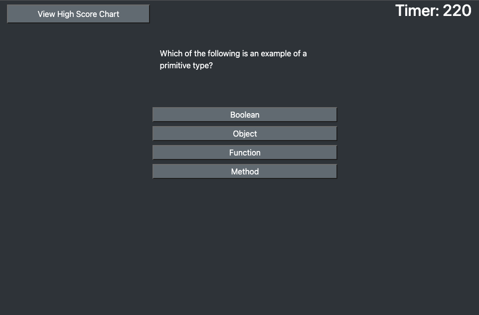

# Quiz Wiz

Quiz Wiz is JavaScript quiz web application. It features a timed JavaScript quiz with a high score chart saved to local storage. See if you can answer all 20 questions correctly in 5 minutes!

I built this using Bootstrap and jQuery. You can try it in mobile as well!

## Deployment

https://josh2100.github.io/quiz-wiz/

## Screenshot

User story

AS A coding boot camp student
I WANT to take a timed quiz on JavaScript fundamentals that stores high scores
SO THAT I can gauge my progress compared to my peers

Acceptance Criteria

GIVEN I am taking a code quiz
WHEN I click the start button
THEN a timer starts and I am presented with a question
WHEN I answer a question
THEN I am presented with another question
WHEN I answer a question incorrectly
THEN time is subtracted from the clock
WHEN all questions are answered or the timer reaches 0
THEN the game is over
WHEN the game is over
THEN I can save my initials and score

Add highscore clickability
Center everything
Make responsive
Create Readme with screenshot
Add more questions
